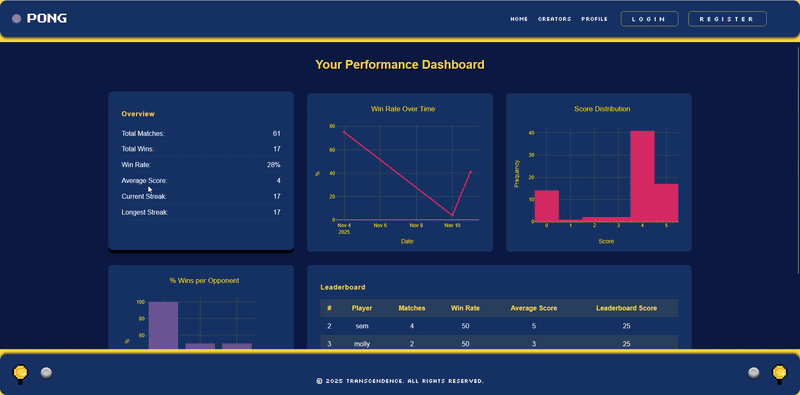

# 📊 User Dashboard

The User Dashboard transforms in-game data into interactive insights on player performance.
It combines server-side data aggregation with frontend visualization to help players understand their progress, strengths, and match history.

---
## 🎯 Overview
The dashboard retrieves player statistics via a RESTful endpoint and visualizes them with Plotly.js.
It dynamically adjusts based on user activity — displaying charts only when enough matches have been played.

This module demonstrates:
- Full-stack data aggregation and analytics rendering
- Integration between Fastify, Prisma ORM, and Plotly.js
- Clean UI design with modular components and dynamic styling

---
## ⚙️ Architecture
- **Data Source:** Match and player tables in SQLite, queried via Prisma.
- **Backend:** API endpoints aggregate data (win rate, total matches, streaks).
- **Frontend:** Visualized using Plotly.js 

---
## 🎥 Demo
 

---
## 📊 Statistics and Charts
### Performance Statistics

| Metric | Description |
|:-----------|:------------|
| Total Matches | Number of games played by the user|
| Total Wins | Count of matches won |
| Win Rate (%) | Ratio of wins to total matches |
| Average Score | Mean number of points scored per match |
| Current Win Streak | Number of consecutive wins in progress |
| Longest Win Streak | Highest consecutive win streak ever recorded |

### Interactive Charts
| Chart	| Description | 
|:-----------|:------------|
| Win Rate Over Time | Line chart plotting daily win rate (%) across all finished sessions | 
| Score Distribution | Histogram of final game scores (0–5) |
| Wins per Opponent | Bar chart comparing win rates against the five most-played opponents | 
| Leaderboard | Table ranking users by a composite score based on win rate, total matches, and average score |