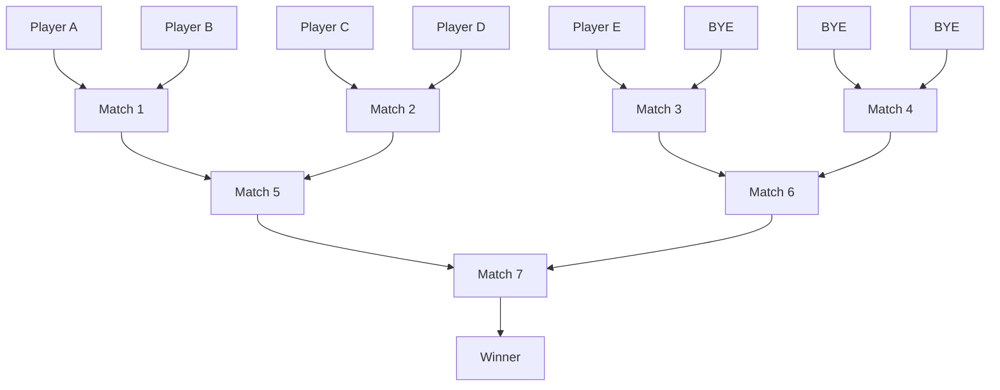

# 🧠 Tournament Matching

The Tournament System uses a Single-Elimination Tournament Engine that supports any number of players (as long as there are at least 2), including non-power-of-two counts such as 3 or 5.

This engine is robust and scalable because it models the bracket as a binary tree structure stored using array-style indexing and combines recursion for winner propagation. 

This is a backend-focused, implementation-level document. For the high-level tournament flow and screenshots, see [tournament.md](./tournament.md).

---

# 🔢 1. Bracket Size Computation (Power-of-Two Rounding)

The tournament bracket can be modeled as a complete binary tree, where every match must have exactly two players. Round 1 matches form the leaves and the final match the root. 

Consequently, this structure requires the total number of player slots to be a power of 2 (e.g., 2, 4, 8, 16). To support arbitrary numbers of participants, the system computes the bracket size by rounding up to the nearest power of 2. Exgtra slots are filled with 'Byes'. A Bye is a placeholder for a missing player and is treated as an automatic, no-contest win for the other player. This ensures that every round is full, matches divide equally, and the bracket remains a complete binary tree. 

If a match contains only one real player, the real player automatically advances to the next round without playing. If a match contains two Byes, the entire branch is skipped as a 'dead match'.

| Players | Bracket Size | Byes |
| ------- | ----------- | ---- |
| 3       | 4           | 1    |
| 5       | 8           | 3    |
| 6       | 8           | 2    |
| 9       | 16          | 7    |


For example, in the bracketing for 5 players:
- 3 Byes are included to make up a bracket size of 8
- There are a total of 7 matches, of which only 4 are actually played: Matches 1, 2, 5 and 7
- Match 3 contains Player E vs Bye, so Player E automatically advances to Match 6
- Match 4 contains Bye vs Bye, making it a dead match. Its winner is effectively a Bye that gets passed upwards into Match 6
- Therefore, Match 6 becomes Player E vs Bye, and Player E automatically advances again into Match 7, the final.



---
# 🎲 2. Player Seeding Algorithm

To avoid favouring any player based on some default ordering (e.g., alphabetically or by join order), the engine randomly seeds players into the Round 1 brackets). 

Players are randomized using the Fisher-Yates shuffle:

1. Players are placed into an array
2. The algorithm moves from right to left (from back to front) and at each step: pick a random index ≤ the current index and swap the two players

This ensures that each player has an equal chance of appearing in any seed position and the randomness is mathematically fair. By contrast, naive shuffle approaches, such as sorting with a random comparator, do not visit all permutations with equal probability as sorting algorithms do not compare all elements equally. 

---
# 🏗️ 3. Architecture 

The tournament bracket is represented as a complete binary tree but stored using heap-style arrays rather than explicit tree nodes. 

Specifically, matches are indexed like nodes in a binary heap. Parents and children are computed mathematically. Hence, the match index encodes its round, its position within the round, its parent match and its sibling matches. 

### Why this design?

- No need to reconstruct a tree in memory (no pointers as well)
- Parent/child relationships are computed with indexing math  
- Easy to scale (2–16 players, or more) 
- SQL-friendly (every match is just a row in a table)  
- Natural support for BYEs 
- Works well with recursive propagation of winners

As a result, the structure is fast, deterministic, and scalable. 

### Tournament Brackets / Binary Tree with 5 Players


### Actual Representation in a Linear Array
```
Array (1-indexed):

  index →   1        2        3        4        5           6           7
            -------------------------------------------------------------------
  match     M1       M2       M3       M4       M5          M6          M7
  players   A vs B   C vs D   E vs -   - vs -   W(M1,M2)    W(M3,M4)    W(M5,M6)


```

---
# 🔁 4. Winner Propagation (Core Recursive Algorithm)

When a match finishes, the winner advances to the next round using a recursive algorithm:

1. Insert the winner into the correct parent match.

2. If the parent now has two players, create a new game session

3. If the parent only has one player, check that the sibling match is empty. If so, auto-advance this player into the next round

4. Propagate winners recursively until the final match receives two players, or the tournament is completed. 

This is a recursive tree traversal that allows Byes to bubble up through multiple rounds, and hence support non-power-of-2 player counts.

