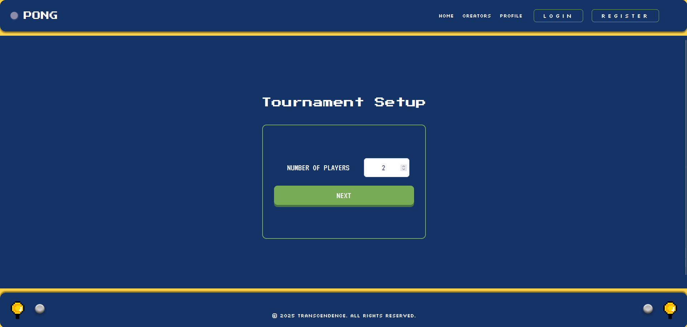
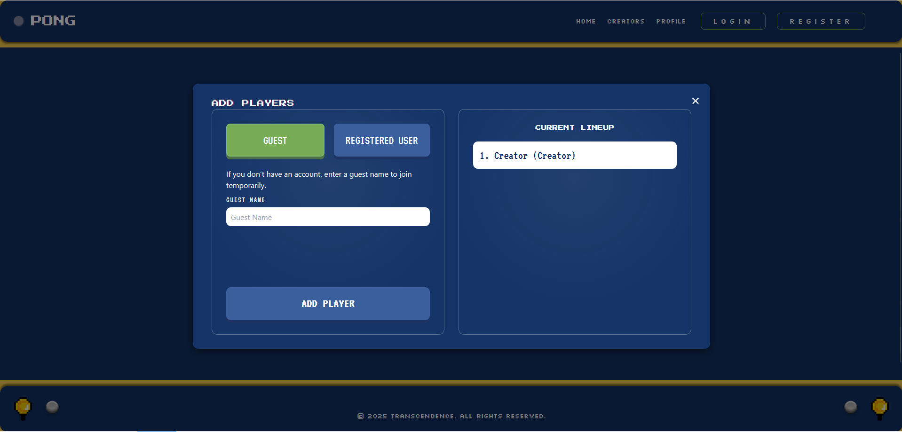
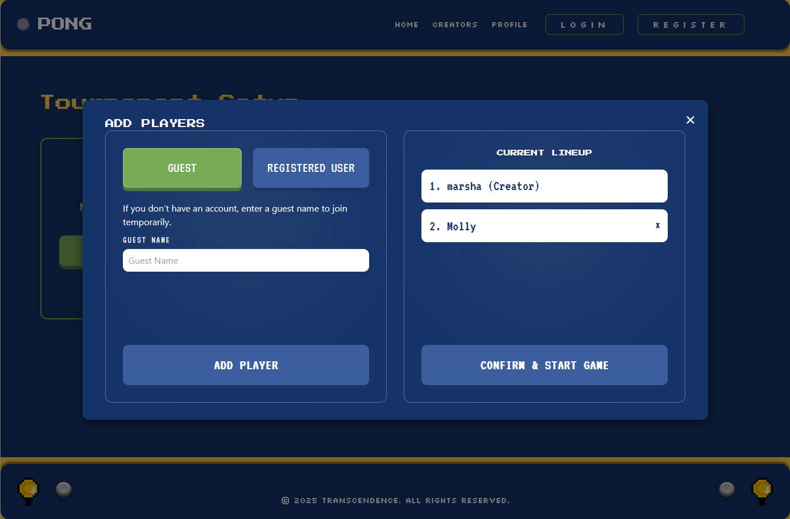
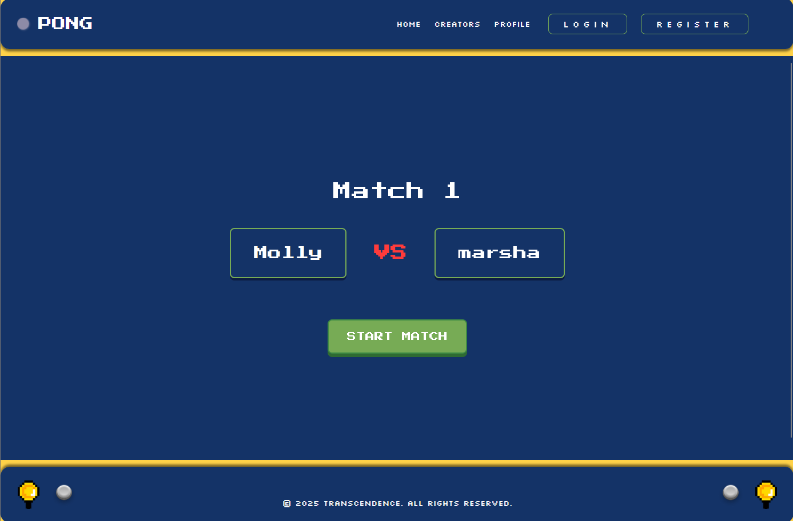
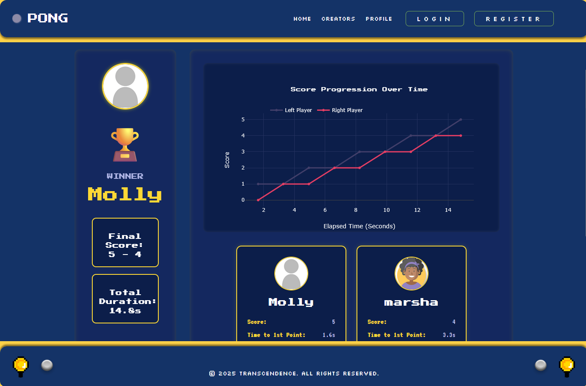
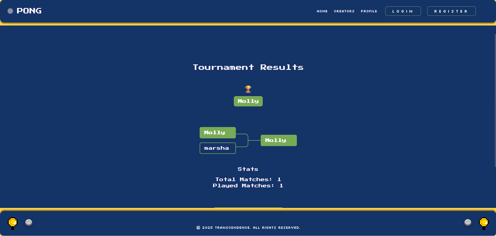

# 🏆 Tournament System

The Tournament System manages registration, player validation, matchmaking, and round progression in real time. It is designed to support both registered users and guest players, enabling flexible gameplay and automated bracket generation. Results are synchronized through RESTful APIs and persistent database states.

---

## 🎯 Overview

The tournament flow is divided into three main stages:

1. **Draft Creation** — The user initiates a tournament, specifies the number of players, and enters details for each.
2. **Match Progression** — The backend orchestrates the sequence of matches, updating results and broadcasting the next game to start.
3. **Results Display** — When all rounds conclude, the final results and statistics are shown with an option to restart a new tournament.

For a full step-by-step visualization of how the user, frontend and backend interact, see the Tournament Sequence Flow.

---
## 🧩 Key Design Features

### 1. Flexible Player Support
- Accepts both registered users and guest players
- Enforces unique display names within each tournament

### 2. Handling Non-Power-of-2 Players
- When player count is not a power of two, the system auto-seeds byes into the first round:
  - Unpaired players are advanced automatically.
  - Each “bye” is represented as a tournament match with only one player slot filled.
  - The backend creates the next-round tournament match once both parent winners exist.

### 3. REST-Based Real-Time Flow
- The client polls or re-fetches state on key events: Match completion, Tournament start or finish
- Each update writes to the database and returns the authoritative state to all clients.

--- 
## 📸 Screenshots
| Screenshot | Description |
|:-----------:|:------------|
|  | **1️⃣ Tournament Setup** — The user defines the number of players and initiates the draft creation process. |
|  | **2️⃣ Add Registered Player** — Registered users can enter credentials to participate in the tournament. |
|  | **3️⃣ Add Guest Player** — Non-registered participants can join using a guest alias. |
|  | **4️⃣ Confirm Draft** — User can validate player list and confirm before the tournament starts. |
|  | **5️⃣ Match In Progress** — User can see the players in the next match as the game proceeds. |
|  | **6️⃣ Match Results** — After each match, dashboard visualizes game progress and lists player statistics. |
|  | **7️⃣ Final Tournament Results** — Displays the tournament bracket, round outcomes, and winner statistics. |
